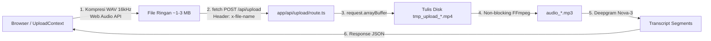
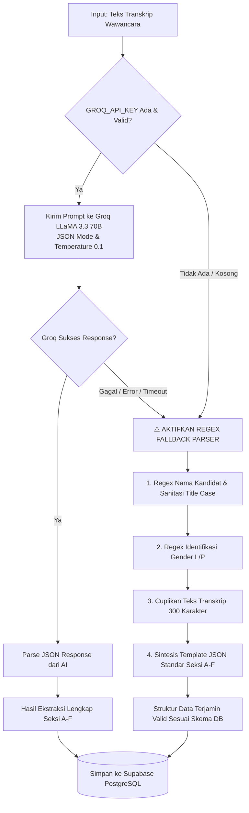
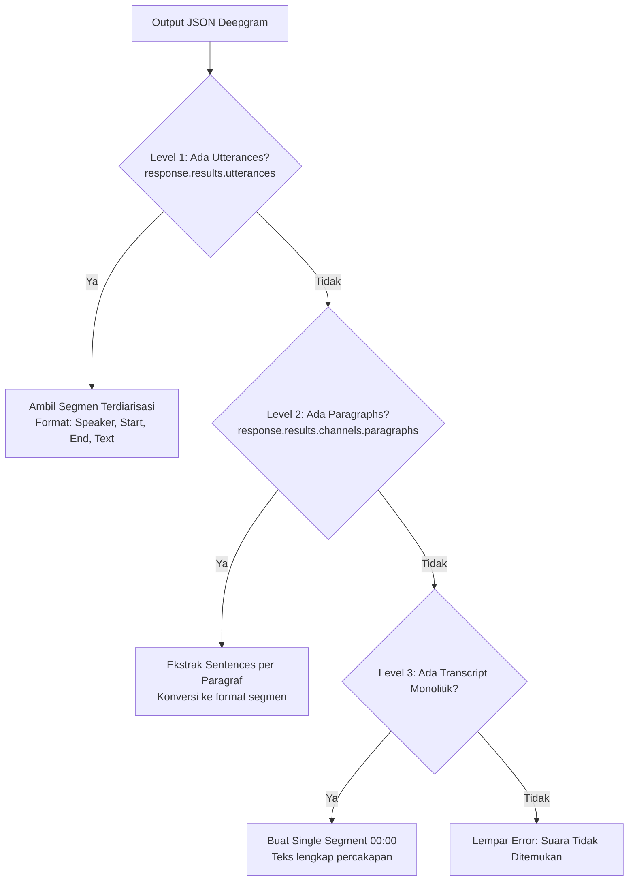

# 🔬 Laporan & Dokumentasi Lanjutan Rekayasa Backend (Deep-Dive)
> **Automated Candidate Extraction Data System (Karla Bionics)**

Dokumentasi ini menyajikan analisis teknis mendalam mengenai **solusi rekayasa, keputusan arsitektur (*engineering decisions*), strategi resiliensi sistem, serta mitigasi error** yang diimplementasikan pada backend aplikasi. Dokumen ini dirancang sebagai referensi teknis komprehensif untuk laporan pekerjaan rekayasa perangkat lunak (*software engineering report*).

---

## 📑 Daftar Isi
1. [Mitigasi Deadlock Buffer Pipe OS pada FFmpeg (`runFFmpeg`)](#1-mitigasi-deadlock-buffer-pipe-os-pada-ffmpeg-runffmpeg)
2. [Dual-Path Upload Architecture: Server Action vs Route Handler](#2-dual-path-upload-architecture-server-action-vs-route-handler)
3. [Logika Fallback Regex NLP Extractor (Offline / Rate-Limit Fallback)](#3-logika-fallback-regex-nlp-extractor-offline--rate-limit-fallback)
4. [Hierarki Ekstraksi & Timeout Protektif Deepgram STT](#4-hierarki-ekstraksi--timeout-protektif-deepgram-stt)
5. [Konfigurasi Payload 500MB & Batas Eksekusi Serverless](#5-konfigurasi-payload-500mb--batas-eksekusi-serverless)
6. [Koneksi Prisma, Supabase Pooler, & Rumus Estimasi Storage](#6-koneksi-prisma-supabase-pooler--rumus-estimasi-storage)
7. [Siklus Hidup Token JWT (Remember Me) & Bypass Middleware](#7-siklus-hidup-token-jwt-remember-me--bypass-middleware)
8. [Utilitas Diagnostik CLI & Seeder Otomatis](#8-utilitas-diagnostik-cli--seeder-otomatis)
9. [Rangkuman Matriks Keputusan Rekayasa Backend](#9-rangkuman-matriks-keputusan-rekayasa-backend)

---

## 1. ⚙️ Mitigasi Deadlock Buffer Pipe OS pada FFmpeg (`runFFmpeg`)

📁 **Lokasi Berkas:** [`app/actions/extract.ts` (Baris 14–38)](file:///c:/Users/user/Documents/MyProject/automated-candidate-data/app/actions/extract.ts#L14-L38)

```typescript
export async function runFFmpeg(args: string[]): Promise<void> {
  return new Promise((resolve, reject) => {
    const ff = spawn("ffmpeg", args);
    let stderrText = "";

    ff.stderr.on("data", (chunk) => {
      stderrText += chunk.toString();
      if (stderrText.length > 50000) {
        stderrText = stderrText.slice(-20000); // Mencegah buffer overflow & memory leak
      }
    });

    ff.on("close", (code) => {
      if (code === 0) resolve();
      else reject(new Error(`FFmpeg error (code ${code}): ${stderrText.slice(-300)}`));
    });

    ff.on("error", (err) => reject(err));
  });
}
```

### 💡 Masalah yang Terjadi di Sistem Operasi (The Problem):
* Saat mengonversi video berukuran besar, FFmpeg secara terus-menerus mencetak log frame dan audio stream ke saluran `stderr`.
* Pada sistem operasi (terutama **Windows OS**), saluran komunikasi antar-proses (*IPC Pipe Buffer*) memiliki batas memori bawaan yang sangat kecil (hanya **64 KB**).
* Jika fungsi Node.js biasa seperti `execFileAsync` atau `execSync` digunakan, buffer 64 KB tersebut akan cepat penuh. Ketika buffer penuh dan tidak segera dibersihkan, sistem operasi akan **menghentikan paksa (freeze/deadlock)** proses FFmpeg tanpa pernah selesai.

### 🛡️ Solusi Rekayasa yang Diterapkan:
1. **Menggunakan `child_process.spawn` Berbasis Event Stream**: Aliran log `stderr` ditangkap secara *real-time* dan non-blocking melalui event `.on("data")`.
2. **Pemangkasan Buffer Aktif (`stderrText.slice(-20000)`)**: Jika log teks melebihi 50.000 karakter, sistem otomatis membuang log lama dan hanya menyimpan 20.000 karakter terakhir. Hal ini menjaga penggunaan memori RAM tetap sangat kecil sekaligus tetap menyimpan pesan error terakhir jika terjadi kegagalan konversi.

---

## 2. 🛣️ Dual-Path Upload Architecture: Server Action vs Route Handler

Dalam arsitektur backend Next.js (App Router), aplikasi ini menyediakan dua jalur berbeda untuk menangani unggahan media (file audio/video) dan pemrosesan AI:

1. **Jalur REST Route Handler (`POST /api/upload`)**: Endpoint HTTP RESTful khusus untuk transmisi data mentah (*binary stream*).
2. **Jalur Server Action (`uploadAndExtract(formData)`)**: Fungsi RPC (*Remote Procedure Call*) berbasis `FormData` yang dipanggil langsung seperti fungsi TypeScript biasa di server.

### 📊 Tabel Perbandingan Teknis

| Karakteristik | 🚀 REST Route Handler (`POST /api/upload`) | ⚡ Server Action (`uploadAndExtract`) |
| :--- | :--- | :--- |
| **Lokasi Berkas** | [`app/api/upload/route.ts`](file:///c:/Users/user/Documents/MyProject/automated-candidate-data/app/api/upload/route.ts) | [`app/actions/extract.ts`](file:///c:/Users/user/Documents/MyProject/automated-candidate-data/app/actions/extract.ts#L641-L700) |
| **Protokol / Format Input** | **Raw Binary Stream (`request.arrayBuffer()`)** | **Multipart Form-Data (`FormData`)** |
| **Metadata File** | Dikirim melalui Custom HTTP Header (`x-file-name`) | Di-parsing otomatis dari `formData.get('file')` |
| **Penggunaan di Frontend** | Digunakan oleh [`UploadContext.tsx`](file:///c:/Users/user/Documents/MyProject/automated-candidate-data/app/context/UploadContext.tsx#L127-L134) untuk **Background Task** | Digunakan untuk direct form submission / testing RPC |
| **Maksimal Durasi Eksekusi** | Dideklarasikan eksplisit: `export const maxDuration = 300` (5 menit) | Mengikuti konfigurasi default timeout server action |
| **Interaksi Middleware** | Dikecualikan eksplisit di `middleware.ts` (`(?!api/upload)`) | Melewati evaluasi cookie/session middleware standar |
| **Pelacakan Status / Progress** | Sangat fleksibel (mendukung stream status per tahap) | Menunggu eksekusi selesai (*atomic resolve*) |

---

### 🔍 Bedah Jalur 1: REST Route Handler (`POST /api/upload`)
Jalur ini merupakan **jalur utama produksi** yang digunakan oleh antarmuka dashboard:



#### Mengapa Route Handler Dibuat Khusus untuk Ingesti Media?
1. **Dukungan Binary Stream Ringan**: Dengan membaca payload melalui `request.arrayBuffer()`, server tidak perlu melakukan *overhead* parsing boundary multipart `FormData`.
2. **Kustomisasi Header Presisi**: Nama file asli dienkripsi dengan aman via header `x-file-name: encodeURIComponent(file.name)` agar tidak rusak oleh karakter khusus/spasi.
3. **Konfigurasi Serverless Timeout**:
   ```typescript
   export const maxDuration = 300; // 5 menit (300 detik) batas eksekusi di serverless
   export const dynamic = "force-dynamic"; // Mencegah caching statis
   ```
4. **Pengecualian Middleware**: Pada `middleware.ts`, endpoint `/api/upload` sengaja dikecualikan:
   ```typescript
   export const config = {
       matcher: ['/((?!api/upload|_next/static|_next/image|favicon.ico).*)'],
   };
   ```
   Hal ini memastikan pengiriman payload audio berukuran besar tidak dicegat atau mengalami *bottleneck* oleh eksekusi dekripsi JWT di Edge Runtime.

---

### 🔍 Bedah Jalur 2: Server Action (`uploadAndExtract`)
Jalur ini mengadopsi pola modern Next.js Server Actions:

```typescript
export async function uploadAndExtract(formData: FormData) {
    const file = formData.get('file') as File;
    const arrayBuffer = await file.arrayBuffer();
    const buffer = Buffer.from(arrayBuffer);
    // Simpan -> FFmpeg -> Deepgram -> Hapus Temp
    ...
}
```

* **Kelebihan**: Sangat praktis karena dipanggil layaknya memanggil fungsi lokal di JavaScript (`await uploadAndExtract(formData)`) dengan *type safety* bawaan TypeScript.
* **Keterbatasan**: Server Action mengirimkan seluruh data form secara monolitik. Jika user berpindah halaman saat upload berlangsung, *promise* di React Component bisa terlepas (*unmount*), sehingga sulit dipantau di background tanpa state manager global.

---

### 💡 Alasan Keputusan Desain (Engineering Decision) untuk Laporan:
> *"Kami menerapkan **Dual-Path Media Ingestion Architecture** untuk memisahkan antara transmisi data media bervolume tinggi dengan logika bisnis aplikasi:*
> 1. *Endpoint **REST Route Handler (`/api/upload`)** dioptimasi khusus untuk efisiensi aliran data biner mentah (*raw binary stream*), dilengkapi toleransi timeout hingga 300 detik dan integrasi penuh dengan `UploadContext` untuk pemrosesan latar belakang (*background persistence*).*
> 2. *Modul **Server Actions (`extract.ts` & `candidate.ts`)** difokuskan untuk operasi RPC berkecepatan tinggi seperti inferensi LLM (`extractDataFromTranscript`), query relasional Supabase, dan revalidasi cache Next.js (`revalidatePath`)."*

---

## 3. 🛡️ Logika Fallback Regex NLP Extractor (Offline / Rate-Limit Fallback)

📁 **Lokasi Berkas:** [`app/actions/extract.ts` (Baris 789–832)](file:///c:/Users/user/Documents/MyProject/automated-candidate-data/app/actions/extract.ts#L789-L832)

### 1. 🎯 Latar Belakang & Urgensi (Mengapa Fitur Ini Ada?)
Dalam arsitektur backend berbasis AI pihak ketiga (*cloud LLM* seperti Groq/OpenAI), terdapat beberapa risiko kegagalan sistem:
1. **Rate Limiting (HTTP 429)**: Kuota *Tokens Per Minute* (TPM) atau *Requests Per Minute* (RPM) Groq habis.
2. **Service Outage / Timeout**: Server Groq sedang mengalami gangguan (*downtime*) atau koneksi internet lambat.
3. **Missing API Key**: Environment variable `GROQ_API_KEY` belum dikonfigurasi saat pertama kali diinstal.

Jika sistem bergantung 100% pada LLM tanpa mekanisme cadangan (*fallback*), maka seluruh proses unggah rekaman wawancara yang sudah memakan waktu transkripsi audio akan **gagal total (*crash*)** dan data kandidat tidak akan pernah tersimpan ke database.

**Solusi Rekayasa**: Dibuatlah **Deterministic Rule-Based Regex Fallback Parser**. Sistem akan menjamin bahwa **apapun yang terjadi pada layanan LLM, data kandidat tetap berhasil dibuat di database dan asesor dapat langsung mengedit form secara manual di Asesmen Studio.**

---

### 2. 🔄 Diagram Alur Kerja (Flowchart)



---

### 3. 🔬 Bedah Algoritma & Logika Kode Langkah demi Langkah

```typescript
// Fallback Local Parser
const text = transcriptText || "";
let nama = "Kandidat Baru";
```

#### A. Ekstraksi Nama Kandidat via Regular Expression & Sanitasi
```typescript
const namaMatch = 
    text.match(/(?:nama saya|nama|saudara|saudari|bapak|ibu|kang)\s+([A-Za-z\s]{3,30})/i);

if (namaMatch && namaMatch[1]) {
    const rawName = namaMatch[1].trim().split(/[\.,\?!\n]/)[0];
    if (rawName.length > 2 && rawName.length < 30) {
        nama = rawName.split(" ").map(w => w.charAt(0).toUpperCase() + w.slice(1).toLowerCase()).join(" ");
    }
}
```
* **Logika Regex**: Mencari frasa percakapan perkenalan khas Bahasa Indonesia seperti *"nama saya [Nama]"*, *"nama [Nama]"*, *"saudara [Nama]"*, atau panggilan lokal seperti *"kang [Nama]"*.
* **Sanitasi Tanda Baca**: Menggunakan `split(/[\.,\?!\n]/)[0]` agar kalimat lanjutan setelah titik/koma tidak ikut terbaca sebagai nama.
* **Format Title Case**: Mengubah teks menjadi huruf kapital di setiap awal kata (contoh: `"yoseph setiawan"` $\rightarrow$ `"Yoseph Setiawan"`).
* **Batas Karakter**: Membatasi panjang nama antara 3 s/d 30 karakter untuk mencegah teks transkrip panjang salah terdeteksi sebagai nama.

#### B. Deteksi Jenis Kelamin (Gender)
```typescript
let jenisKelamin = "-";
if (/saudara|bapak|pria|laki-laki|kang/i.test(text)) {
    jenisKelamin = "Laki-laki";
} else if (/saudari|ibu|wanita|perempuan|teh/i.test(text)) {
    jenisKelamin = "Perempuan";
}
```
* Menggunakan pencarian kata kunci (*keyword matching*) berbasis sapaan dan kata ganti dalam budaya percakapan Indonesia.

#### C. Ringkasan & Cuplikan Transkrip (*Preview Snippet*)
```typescript
const previewSnippet = text.slice(0, 300).trim() || "-";
```
* Mengambil 300 karakter pertama dari transkrip wawancara untuk mengisi kolom ringkasan awal (`ringkasan`) dan `seksiA.kegiatanSehariHari`, sehingga asesor tetap memiliki konteks pembuka percakapan.

#### D. Sintesis Skema JSON 6-Seksi (*Deterministic Schema Compliance*)
```typescript
const parsedJson = {
    nama,
    umur: "-",
    jenisKelamin,
    seksiA: { 
        kegiatanSehariHari: previewSnippet, 
        riwayatKondisi: "-", 
        kondisiLengan: "-", 
        perubahanKesulitan: "-", 
        pengalamanProstetik: "-", 
        bantuanSehariHari: "-" 
    },
    seksiB: { 
        alasanRagaArm: "Permohonan alat bantu prostetik Raga Arm.", 
        harapanUtama: "Dapat beraktivitas mandiri.", 
        komitmenHarian: "Sanggup", 
        kesiapanAdaptasi: "10/10" 
    },
    seksiC: { 
        rencanaMasaDepan: "Bekerja mandiri", 
        peranRagaArm: "Meningkatkan produktivitas" 
    },
    seksiD: { 
        sumberPenghasilan: "Hasil usaha / pekerjaan", 
        tanggunganKeluarga: "Keluarga" 
    },
    seksiE: { 
        kesiapanKeBandung: "Bersedia", 
        laporanPublikasi: "Bersedia", 
        minatPelatihan: "Berminat" 
    },
    seksiF: { 
        tantanganBangkit: "Tetap semangat", 
        hubunganKeluarga: "Baik", 
        hubunganTeman: "Baik", 
        kegiatanSosial: "Aktif" 
    }
};
```
* **Kepatuhan Tipe Data (*Type-Safe Integrity*)**: Halaman antarmuka frontend ([`candidates/[id]/page.tsx`](file:///c:/Users/user/Documents/MyProject/automated-candidate-data/app/dashboard/candidates/%5Bid%5D/page.tsx)) memerlukan struktur JSON yang utuh untuk me-render 6 seksi formulir. 
* Jika JSON tidak lengkap, halaman frontend bisa melempar error `undefined property`. Fallback ini menjamin struktur objek selalu valid 100%.

---

### 4. 📊 Perbandingan Output: Groq LLM vs Regex Fallback

| Parameter | Ekstraksi Groq LLM (LLaMA 3.3 70B) | Ekstraksi Regex Fallback Parser |
| :--- | :--- | :--- |
| **Ketergantungan Jaringan** | Butuh koneksi internet & API Key Groq | Berjalan 100% lokal di CPU server (0 ms latency) |
| **Akurasi Kontekstual** | Sangat tinggi (membedakan pembicara 0 dan 1) | Berbasis pola kata kunci (*pattern-based*) |
| **Kelengkapan Seksi A–F** | Mengekstrak detail narasi spesifik dari ucapan | Mengisi template default yang siap disunting asesor |
| **Resiliensi Sistem** | Rentan limit kuota (HTTP 429) | **100% kebal kegagalan (*fail-safe*)** |

---

### 💡 Poin Utama untuk Laporan Pekerjaan Anda:
> *"Implementasi fallback parser berbasis Regular Expression ini menerapkan prinsip **Fault-Tolerant & Graceful Degradation Design**. Ketika sistem AI generatif eksternal mengalami kendala kuota atau koneksi, backend tidak mengalami fatal crash, melainkan beralih secara transparan ke parser lokal sehingga alur kerja klinis asesor tidak pernah terhenti."*

---

## 4. 🎙️ Hierarki Ekstraksi & Timeout Protektif Deepgram STT

📁 **Lokasi Berkas:** [`app/actions/extract.ts` (Baris 382–460)](file:///c:/Users/user/Documents/MyProject/automated-candidate-data/app/actions/extract.ts#L382-L460)

### A. Proteksi Timeout 10 Menit (`Promise.race`)
Rekaman audio wawancara klinis sering kali berdurasi 30 hingga 60 menit. Jika koneksi API ke server Deepgram terputus di tengah jalan, proses Node.js bisa menggantung selamanya.

```typescript
const timeoutPromise = new Promise((_, reject) =>
    setTimeout(() => reject(new Error("Deepgram API request timed out (lebih dari 10 menit)")), 600000)
);

const response = await Promise.race([deepgramPromise, timeoutPromise]);
```
* **Cara Kerja**: Menjalankan *balapan* (*race condition*) antara proses transkripsi dan timer 600.000 ms (10 menit). Jika dalam 10 menit Deepgram belum merespons, proses langsung dihentikan dengan aman dan pesan error yang jelas diberikan kepada pengguna.

---

### B. Parser Bertingkat 3-Level (3-Tier Payload Parser)
Struktur output JSON dari Deepgram bisa berbeda tergantung kualitas rekaman audio. Sistem kami menggunakan parser bertingkat agar data tidak pernah hilang:



1. **Level 1 (`utterances`)**: Mode utama dengan pemisahan pembicara (*Speaker 0: Interviewer* vs *Speaker 1: Kandidat*).
2. **Level 2 (`paragraphs.sentences`)**: Cadangan jika diarisasi gagal mendeteksi perbedaan pita suara.
3. **Level 3 (`alternatives[0].transcript`)**: Cadangan darurat berupa teks monolitik tanpa penanda waktu per kata.

---

## 5. 📦 Konfigurasi Payload 500MB & Batas Eksekusi Serverless

📁 **Lokasi Berkas:** [`next.config.ts`](file:///c:/Users/user/Documents/MyProject/automated-candidate-data/next.config.ts) & [`app/api/upload/route.ts`](file:///c:/Users/user/Documents/MyProject/automated-candidate-data/app/api/upload/route.ts#L7-L9)

### Mengapa Konfigurasi Ini Wajib?
Secara default, framework Next.js membatasi ukuran request body yang masuk hanya sebesar **1 MB s/d 2 MB** untuk alasan keamanan. Namun, file rekaman wawancara video (MP4/MKV) sering kali berukuran ratusan MB.

```typescript
// next.config.ts
const nextConfig: NextConfig = {
  experimental: {
    serverActions: {
      bodySizeLimit: "500mb", // Mengizinkan payload video besar masuk ke Server Action
    },
    middlewareClientMaxBodySize: "500mb",
  },
};
```

Dan pada Route Handler [`/api/upload`](file:///c:/Users/user/Documents/MyProject/automated-candidate-data/app/api/upload/route.ts):
```typescript
export const maxDuration = 300; // Maksimum eksekusi 5 menit (300 detik)
export const dynamic = "force-dynamic"; // Mencegah caching statis
```
* **`maxDuration = 300`**: Memberikan waktu komputasi hingga 5 menit pada platform cloud serverless (seperti Vercel) agar pemrosesan video dan ekstraksi audio tidak terputus di tengah jalan.

---

## 6. 🗄️ Koneksi Prisma, Supabase Pooler, & Rumus Estimasi Storage

📁 **Lokasi Berkas:** [`lib/prisma.ts`](file:///c:/Users/user/Documents/MyProject/automated-candidate-data/lib/prisma.ts) & [`app/actions/candidate.ts`](file:///c:/Users/user/Documents/MyProject/automated-candidate-data/app/actions/candidate.ts#L247-L297)

### A. Mencegah Kebocoran Koneksi via Singleton Pattern
Pada lingkungan pengembangan Next.js (*development mode*), setiap kali Anda mengubah kode, fitur *Fast Refresh / Hot Reload* akan me-restart modul server. Jika instance database dibuat sembarangan, puluhan koneksi baru akan terbuka ke Supabase hingga kuota koneksi habis (*pool starvation*).

```typescript
// lib/prisma.ts
const pool = new Pool({ connectionString });
const adapter = new PrismaPg(pool);

// Menyimpan instance ke globalThis agar tidak dibuat ulang saat hot-reload
const prisma = globalThis.prismaGlobal ?? new PrismaClient({ adapter });
if (process.env.NODE_ENV !== 'production') globalThis.prismaGlobal = prisma;
```

---

### B. Perbedaan Port `DATABASE_URL` (6543) vs `DIRECT_URL` (5432)
* **Port `6543` (`DATABASE_URL` dengan `?pgbouncer=true`)**: Digunakan oleh aplikasi web saat berjalan. Koneksi dialirkan melalui PgBouncer *connection pooler* Supabase agar ratusan request web dapat dilayani tanpa membebani memori database PostgreSQL.
* **Port `5432` (`DIRECT_URL`)**: Koneksi langsung ke engine PostgreSQL, digunakan saat menjalankan perintah Prisma CLI seperti `npx prisma db push` atau migrasi skema tabel.

---

### C. Algoritma Cadangan Estimasi Kapasitas Database
Pada widget monitoring kapasitas penyimpanan di sidebar, sistem menjalankan query PostgreSQL:
```sql
SELECT pg_database_size(current_database()) as size;
```
Namun, pada database cloud tertentu, fungsi `pg_database_size()` terkadang dibatasi izin aksesnya (*restricted privileges*). Backend mengantisipasinya dengan **rumus estimasi matematis cadangan**:

$$\text{Estimasi Byte} = (\text{Total Kandidat} \times 150\text{ KB} + \text{Total User} \times 10\text{ KB} + 500\text{ KB Base Skema}) \times 1024$$

* **150 KB per kandidat**: Rata-rata ukuran teks transkrip JSON terdiarisasi + form klinis Seksi A–F.
* **10 KB per user**: Akun kredensial dan metadata waktu pendaftaran.

---

## 7. 🔑 Siklus Hidup Token JWT (Remember Me) & Bypass Middleware

📁 **Lokasi Berkas:** [`app/tokens/session.ts`](file:///c:/Users/user/Documents/MyProject/automated-candidate-data/app/tokens/session.ts) & [`middleware.ts`](file:///c:/Users/user/Documents/MyProject/automated-candidate-data/middleware.ts)

### A. Kebijakan Masa Aktif Token Dinamis
```typescript
export async function createSession(userId: number, rememberMe: boolean = false) {
    const expiresInMs = rememberMe 
        ? 30 * 24 * 60 * 60 * 1000  // 30 Hari jika user mencentang 'Ingat Saya'
        : 60 * 60 * 1000;            // 1 Jam jika sesi standar publik
    ...
}
```
* **`rememberMe = true`**: Token berlaku selama **30 hari**, cocok untuk perangkat kerja pribadi asesor klinis.
* **`rememberMe = false`**: Token otomatis hangus setelah **1 jam**, melindungi data medis jika diakses dari komputer bersama di klinik/workshop.

---

### B. Keamanan Cookie `HttpOnly` & Pengecualian Middleware
Cookie sesi disimpan dengan parameter ketat:
* `httpOnly: true`: Mencegah script JavaScript pihak ketiga / malware browser mencuri token (kebal serangan XSS).
* `secure: true`: Cookie hanya ditransmisikan melalui protokol terenkripsi HTTPS.
* `sameSite: "lax"`: Mencegah serangan pemalsuan permintaan antar-situs (CSRF).

Pada [`middleware.ts`](file:///c:/Users/user/Documents/MyProject/automated-candidate-data/middleware.ts#L18-L20):
```typescript
export const config = {
    matcher: ['/((?!api/upload|_next/static|_next/image|favicon.ico).*)'],
};
```
* **Alasan Regex `(?!api/upload)`**: Endpoint upload file binary dikecualikan dari middleware Edge agar transfer file video ratusan MB tidak mengalami degradasi performa (*latency*) akibat proses parsing cookie yang berulang pada setiap potongan chunk data.

---

## 8. 🛠️ Utilitas Diagnostik CLI & Seeder Otomatis

📁 **Lokasi Berkas:** [`prisma/check-db-status.ts`](file:///c:/Users/user/Documents/MyProject/automated-candidate-data/prisma/check-db-status.ts) & [`prisma/seed.ts`](file:///c:/Users/user/Documents/MyProject/automated-candidate-data/prisma/seed.ts)

### A. Diagnostik Mandiri via CLI (`check-db-status.ts`)
Tanpa perlu membuka browser atau antarmuka dashboard, pengembang dan tim QA dapat menguji kesehatan seluruh lapisan backend dengan satu perintah:
```bash
npx tsx prisma/check-db-status.ts
```

Skrip ini melakukan 4 pengujian otomatis berurutan:
1. **Verifikasi Koneksi Tabel User**: Membaca jumlah akun terdaftar dan waktu pendaftaran.
2. **Integritas Format JSON Kandidat**: Membaca seluruh kandidat dan memverifikasi apakah `transcriptJson` dapat di-parse dengan benar menjadi array segmen.
3. **Validasi Agregasi Server Actions**: Menguji fungsi `getDashboardStats()` (Total, Processing, Ready, Verified).
4. **Pengujian Filter Pencarian**: Memastikan fungsi `getCandidates()` merespons query pencarian tanpa error.

---

### B. Database Seeder Otomatis (`seed.ts`)
Memfasilitasi inisialisasi lingkungan pengujian lokal atau staging dengan menyuntikkan:
* Akun staf asesor default dengan password ter-hash bcrypt.
* Contoh profil kandidat lengkap dengan audio placeholder, segmen transkrip multi-speaker, serta data klinis Seksi A sampai Seksi F.

---

## 9. 📊 Rangkuman Matriks Keputusan Rekayasa Backend

| Tantangan Teknis | Dampak Jika Dibiarkan | Solusi Rekayasa yang Diimplementasikan |
| :--- | :--- | :--- |
| **FFmpeg Pipe Buffer Deadlock** | Server freeze saat memproses video panjang | Pemrosesan stream non-blocking dengan pemotongan log 20.000 karakter (`spawn`). |
| **Dual-Path Upload Conflict** | Stream binary terhambat batas FormData | Pemisahan Route Handler `/api/upload` (streaming binary) vs Server Action (RPC). |
| **LLM Rate Limit / Outage** | Gagal simpan data & aplikasi crash | *Deterministic Regex Fallback Parser* (Graceful Degradation). |
| **Deepgram API Hanging** | Request menggantung tanpa batas waktu | `Promise.race` timeout 10 menit + parser 3-tier fallback. |
| **Batas Payload Next.js 1MB** | Gagal unggah file video rekaman lokal | Konfigurasi `bodySizeLimit: 500mb` & Route Handler `maxDuration = 300`. |
| **Koneksi Bocor di Development** | Kuota koneksi Supabase cepat habis | Singleton pattern `globalThis.prismaGlobal` + `@prisma/adapter-pg`. |
| **Kegagalan Query Storage DB** | Indikator penyimpanan di dashboard error | Algoritma estimasi matematis cadangan berbasis jumlah record. |
| **Sesi Komputer Bersama** | Rentan pembajakan akun asesor | Durasi token adaptif (1 jam vs 30 hari) + cookie `HttpOnly` & `SameSite: Lax`. |
