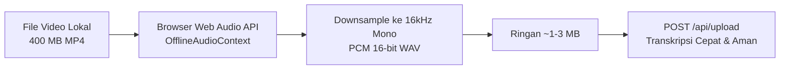
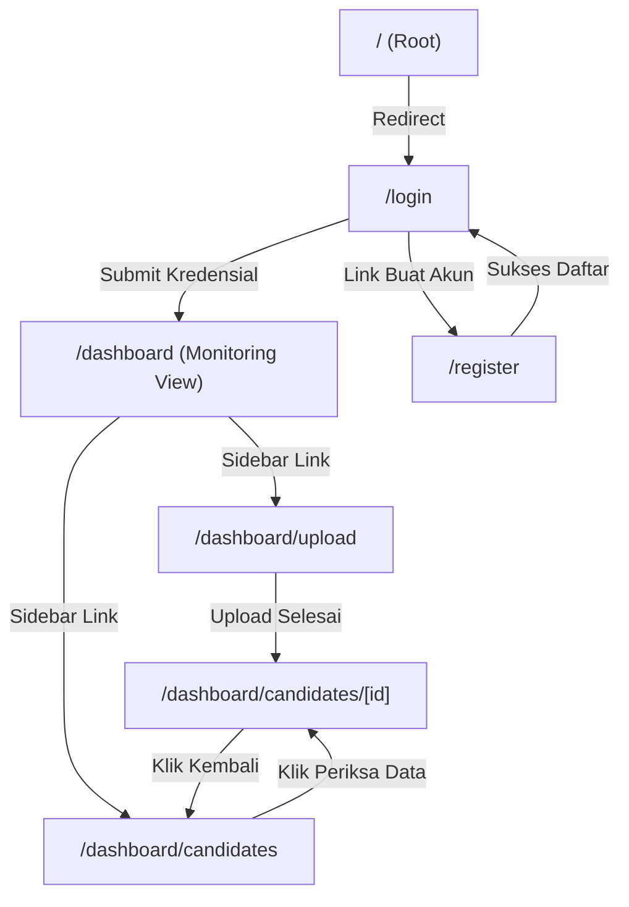

# 🎨 Dokumentasi Arsitektur & Sistem Frontend
**Automated Candidate Extraction Data (Karla Bionics)**

Dokumentasi ini menyajikan analisis komprehensif mengenai arsitektur antarmuka, sistem desain, manajemen *state*, integrasi pemrosesan media berbasis browser, alur interaksi pengguna, serta evaluasi kritis terhadap performa, aksesibilitas, dan UX frontend.

---

## 📌 1. Ringkasan Eksekutif & Tech Stack Frontend

Frontend aplikasi ini dirancang sebagai **Enterprise Medical & Clinical Dashboard** yang memfasilitasi tim asesmen klinis Karla Bionics dalam memproses, mengevaluasi, memvalidasi data transkrip wawancara, dan mengelola profil kandidat calon penerima tangan prostetik (*Raga Arm*).

| Layer / Komponen | Teknologi | Keterangan & Peran |
| :--- | :--- | :--- |
| **Framework & Engine** | **Next.js 16 (App Router)** + **React 19** | Server & Client Components (`use client`), React Server Actions |
| **Styling & Design System** | **Tailwind CSS v4** + `@theme` tokens | Utility-first styling modern dengan palet warna *Deep Teal* & *Slate* |
| **Tipografi & Font** | **Geist Sans** & **Geist Mono** (`next/font/google`) | Tipografi modern dengan keterbacaan tinggi untuk data klinis |
| **Ikonografi** | **Lucide React** | Ikon vektor ringan untuk kontrol pemutar audio, navigasi, dan status |
| **Visualisasi Data** | **Recharts 3.10** | Grafik analitik interaktif (*BarChart* & *PieChart*) di dashboard utama |
| **Notifikasi & Toasts** | **React-Hot-Toast** + Custom Notification Center | Feedback realtime status upload background dan aksi sistem |
| **Audio Processing (Client)** | **Web Audio API** (`OfflineAudioContext`) | Kompresi & downsampling audio di browser (16kHz mono WAV) |
| **State Management** | **React Context API** (`UploadContext`) | Pengelolaan proses background lintas halaman (*task persistence*) |

---

## 📁 2. Struktur Folder & Komponen Frontend

```plaintext
├── app/
│   ├── layout.tsx                    # Root layout (Font Geist, Toaster Global)
│   ├── globals.css                   # Tailwind CSS v4 config & CSS custom variables
│   ├── page.tsx                      # Root redirector ke /login
│   ├── login/
│   │   └── page.tsx                  # Halaman Login Internal Enterprise
│   ├── register/
│   │   └── page.tsx                  # Halaman Pendaftaran Akun Staff/Asesor
│   ├── context/
│   │   └── UploadContext.tsx         # Context global upload, task queue & notifikasi
│   ├── utils/
│   │   └── clientAudio.ts            # Engine kompresi audio in-browser (Web Audio API)
│   └── dashboard/
│       ├── layout.tsx                # Sidebar, Navigasi, & Widget Storage Supabase
│       ├── page.tsx                  # Monitoring View, KPI Card, Visualisasi Recharts
│       ├── upload/
│       │   └── page.tsx              # Dual-Mode Ingestion Studio (Lokal & GDrive)
│       └── candidates/
│           ├── page.tsx              # Daftar Kandidat, Filter Real-time & Delete Action
│           └── [id]/
│               └── page.tsx          # Asesmen Studio: Click-to-Seek Audio & 6 Seksi Asesmen
```

---

## 🎨 3. Design System & Pola Visual (UI/UX)

Antarmuka dibangun dengan estetika klinis modern (*Clinical Grade Design*) yang bersih, intuitif, dan bebas distrasi:

### A. Palet Warna Utama (Color Tokens)
- **Primary / Brand Accent**: `#0F766E` (Teal-700) & `#0D9488` (Teal-600) — Memberikan impresi medis berteknologi tinggi dan menenangkan.
- **Surface & Background**: `#F8FAFC` (Slate-50) & `#FFFFFF` — Latar belakang kontras tinggi untuk memudahkan membaca transkrip panjang.
- **Text Hierarchy**:
  - Judul & Heading: `#0F172A` (Slate-900)
  - Body & Label: `#334155` (Slate-700) / `#64748B` (Slate-500)
  - Monospace Data / Timestamp: `Geist Mono` / `font-mono`
- **Status Indicators**:
  - `Verified` (Terverifikasi): Teal (`bg-teal-50 text-teal-700 border-teal-200`)
  - `Processing` (Diproses AI): Blue (`bg-blue-50 text-blue-700 border-blue-200`)
  - `Ready` (Siap Evaluasi): Amber (`bg-amber-50 text-amber-700 border-amber-200`)
  - `Error / Limit`: Red (`bg-red-50 text-red-700 border-red-200`)

---

## ⚡ 4. Fitur Unggulan Frontend

### 1. In-Browser Audio Downsampler & Compressor (`app/utils/clientAudio.ts`)
Tantangan terbesar web AI transkripsi adalah batas ukuran payload serverless (Vercel max 4.5 MB) dan waktu upload file video ratusan MB. Solusi yang diimplementasikan pada frontend:
- Menggunakan **`OfflineAudioContext` (Web Audio API)** untuk membaca file video/audio lokal (misal 400 MB MP4).
- Mengekstrak kanal suara, menurunkan sampling rate menjadi **16.000 Hz Mono**, dan mengonversinya langsung menjadi file WAV ringan (~1-3 MB) dalam hitungan detik di browser user.
- Mengeliminasi kebutuhan upload video berukuran masif ke server.



---

### 2. Multi-Page Task Persistence (`app/context/UploadContext.tsx`)
- Proses transkripsi dan ekstraksi AI dijalankan di dalam Context global.
- Asesor tidak perlu terpaku menunggu di halaman upload; mereka dapat bebas berpindah ke **Dashboard Monitoring** atau **Candidate List** sementara proses berjalan di background.
- Floating status card dan lonceng notifikasi di *header* akan memperbarui persentase langkah (*Whisper AI -> LLaMA 3 AI -> Supabase*) secara real-time.

---

### 3. Click-to-Seek Interactive Audio & Transcript Studio (`/dashboard/candidates/[id]`)
Ruang kerja utama asesor klinis untuk mereview hasil transkripsi dan data asesmen:
- **Sinkronisasi Dua Arah Audio & Teks**:
  - Saat audio diputar, transkrip yang sedang diucapkan otomatis menyala (*highlight active segment*) dan bergulir otomatis (*smooth auto-scroll*).
  - Mengklik baris teks transkrip manapun akan langsung memindahkan detik pemutaran audio (*seek*) ke *timestamp* kalimat tersebut secara presisi.
- **Pembeda Speaker Otomatis**:
  - Transkrip membedakan warna label secara tegas antara **Interviewer** (Teal) dan **Kandidat** (Navy Blue).

---

### 4. Dynamic Database Capacity Widget (`app/dashboard/layout.tsx`)
- Terletak di sidebar kiri bawah, memantau utilisasi kuota PostgreSQL Supabase (500 MB Free Tier Cap).
- Dilengkapi tombol *refresh* status dan *progress bar* adaptif:
  - Hijau/Teal: Penggunaan < 80%
  - Amber (Kuning): Penggunaan 80% - 90%
  - Merah: Penggunaan > 90% (Peringatan kapasitas penuh)

---

### 5. Form Asesmen Klinis Terstruktur 6-Seksi & Verification Lock
- Form input digital yang mencakup seluruh variabel seleksi *Karla Bionics*:
  - **Demografi**: Nama, Umur, Jenis Kelamin, Status.
  - **Seksi A**: Kebutuhan fisik, riwayat amputasi, dan kegiatan sehari-hari.
  - **Seksi B**: Motivasi penggunaan *Raga Arm* dan komitmen adaptasi.
  - **Seksi C**: Rencana masa depan & target 6-12 bulan.
  - **Seksi D**: Kondisi sosial ekonomi & tanggungan keluarga.
  - **Seksi E**: Kesiapan mobilisasi ke Bandung & komitmen pelaporan rutin.
  - **Seksi F**: Mental, resiliensi bangkit, dan relasi keluarga/komunitas.
- **Tombol "Setujui & Kunci Data"**:
  - Mengubah status kandidat menjadi `Verified`.
  - Mengunci seluruh form input (`disabled={isLocked}`) untuk mencegah perubahan tidak sengaja setelah evaluasi selesai.

---

## 🧭 5. Rute Halaman & Arsitektur Navigasi



---

## 🔍 6. Evaluasi Kritis & Rekomendasi Frontend (Critical Review)

Berikut adalah catatan evaluasi kritis dan rekomendasi peningkatan kualitas frontend:

### ⚠️ 1. Inkonsistensi Feedback Dialog / Alert Pengguna
- **Temuan**: Halaman login menggunakan `alert()`, halaman register menggunakan `react-hot-toast`, sedangkan penghapusan kandidat menggunakan `confirm()`.
- **Dampak UX**: Dialog bawaan browser (`alert`/`confirm`) menghentikan eksekusi thread JS, tidak dapat dikustomisasi tampilannya, dan memberikan kesan kurang profesional.
- **Rekomendasi Solusi**: Standarisasi seluruh interaksi dialog menggunakan komponen **Modal Dialog Kustom** (misal berbasis Radix UI / Headless UI) dan notifikasi *toast* seragam via `react-hot-toast`.

### ⚠️ 2. Pencarian Tanpa Debounce pada Daftar Kandidat (`CandidateListPage`)
- **Temuan**: Pada `app/dashboard/candidates/page.tsx`, `useEffect` memicu pemanggilan Server Action `getCandidates()` pada setiap ketukan karakter di input pencarian (`onChange`).
- **Dampak Performa**: Jika pengguna mengetik cepat 10 karakter, 10 request database dikirimkan dalam 1 detik.
- **Rekomendasi Solusi**: Terapkan teknik *debounce* (delay 300ms) menggunakan custom hook `useDebounce` sebelum memicu pemanggilan server.

### ⚠️ 3. Penanganan Audio Placeholder Eksternal
- **Temuan**: Jika file audio rekaman gagal dimuat atau belum tersedia, audio player pada halaman detail kandidat menggunakan URL fallback eksternal (`SoundHelix-Song-1.mp3`).
- **Dampak Klinis**: Asesor dapat terkecoh mendengar lagu pengujian alih-alih suara rekaman asli kandidat.
- **Rekomendasi Solusi**: Ganti fallback dengan *empty state banner* yang menginformasikan dengan jelas bahwa "Rekaman audio tidak tersedia untuk kandidat ini" dan nonaktifkan tombol putar.

### ⚠️ 4. Potensi Hidrasi Recharts pada SSR
- **Temuan**: Komponen grafik `ResponsiveContainer` Recharts terkadang memicu *warning hydration mismatch* pada Next.js jika dimensi container belum terkalkulasi saat server render.
- **Rekomendasi Solusi**: Pastikan grafik hanya dirender setelah komponen ter-mount di client (menggunakan state `mounted` atau `next/dynamic` dengan `{ ssr: false }`).

---

## 🛠️ 7. Panduan Menjalankan & Mengembangkan Frontend

### 1. Menjalankan Server Lokal
```bash
npm run dev
```
Aplikasi dapat diakses melalui browser di: `http://localhost:3000`.

### 2. Memeriksa Linter & Kesalahan Tipe TypeScript
```bash
npm run lint
```
