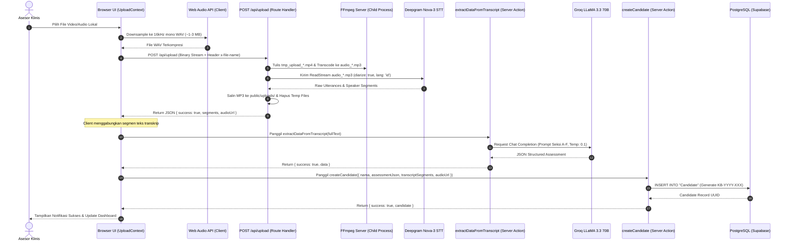
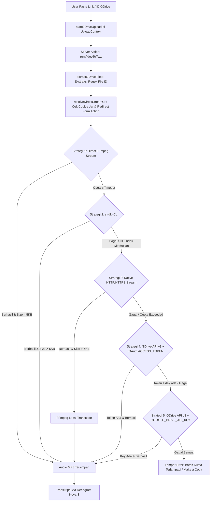
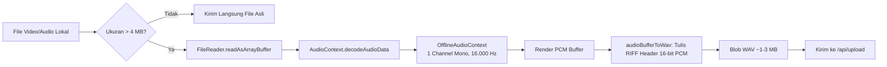
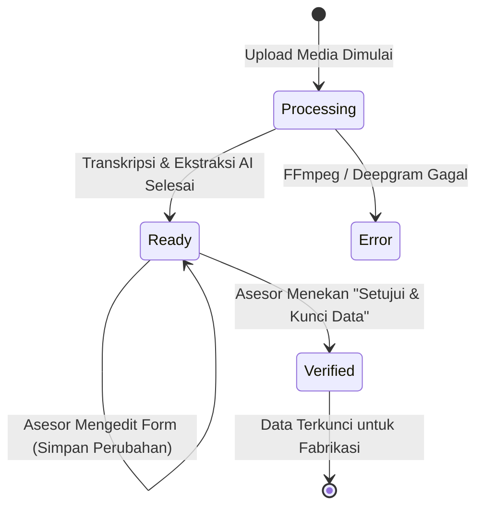

# 📑 Laporan Teknis & Audit Komprehensif Rekayasa Backend
> **Automated Candidate Data Extraction System (Karla Bionics)**  
> *Dokumen Investigasi Kode Sumber, Keputusan Arsitektur, Alur Data, dan Batasan Sistem (Academic & Engineering Deep-Dive)*

---

## 📌 Pengantar & Metodologi Audit

Dokumen ini disusun sebagai **laporan investigasi teknis objektif, kritis, dan netral** berdasarkan inspeksi langsung terhadap seluruh berkas kode sumber di dalam repositori. Laporan ini menjawab secara tuntas **39 pertanyaan kritis arsitektur** untuk keperluan penyusunan Laporan Praktik Kerja Lapangan (PKL) / Tugas Akhir, khususnya Bab IV (Perancangan Sistem) dan Bab V (Implementasi & Pengujian).

---

## 📑 Daftar Isi Analisis 39 Poin Kritis

1. [Alur Sebenarnya Setelah `/api/upload` (Jalur Unggah Lokal)](#1-alur-sebenarnya-setelah-apiupload-jalur-unggah-lokal)
2. [Orkestrasi Pemanggilan Groq LLM: Siapa Pemanggil Sebenarnya?](#2-orkestrasi-pemanggilan-groq-llm-siapa-pemanggil-sebenarnya)
3. [Mekanisme Google Drive Ingestion: Manual Input & Decision Logic](#3-mekanisme-google-drive-ingestion-manual-input--decision-logic)
4. [Autentikasi Google Drive: Batasan Izin Akses File (Public vs Private)](#4-autentikasi-google-drive-batasan-izin-akses-file-public-vs-private)
5. [Implementasi Web Audio API di Browser](#5-implementasi-web-audio-api-di-browser)
6. [Input & Output FFmpeg: Mengapa Terjadi Dua Kali Pemrosesan Audio?](#6-input--output-ffmpeg-mengapa-terjadi-dua-kali-pemrosesan-audio)
7. [Speaker Diarization Deepgram: Pemetaan Speaker 0 & Speaker 1](#7-speaker-diarization-deepgram-pemetaan-speaker-0--speaker-1)
8. [Logika Pemetaan Peran Pembicara di Antarmuka](#8-logika-pemetaan-peran-pembicara-di-antarmuka)
9. [Struktur dan Desain Prompt Groq LLaMA 3.3 70B](#9-struktur-dan-desain-prompt-groq-llama-33-70b)
10. [Strategi Mitigasi Halusinasi pada LLM](#10-strategi-mitigasi-halusinasi-pada-llm)
11. [Validasi Output LLM Sebelum Masuk ke Basis Data](#11-validasi-output-llm-sebelum-masuk-ke-basis-data)
12. [Status & Validitas Data Hasil Regex Fallback (Human-in-the-Loop)](#12-status--validitas-data-hasil-regex-fallback-human-in-the-loop)
13. [Definisi & Siklus Hidup Status Kandidat (*Candidate Lifecycle*)](#13-definisi--siklus-hidup-status-kandidat-candidate-lifecycle)
14. [Implementasi *Verification Lock*: Keamanan Backend vs UI Guard](#14-implementasi-verification-lock-keamanan-backend-vs-ui-guard)
15. [Model Otorisasi Pengguna: Ketiadaan *Role-Based Access Control* (RBAC)](#15-model-otorisasi-pengguna-ketiadaan-role-based-access-control-rbac)
16. [Keamanan Endpoint `/api/upload` yang Mengecualikan Middleware](#16-keamanan-endpoint-apiupload-yang-mengecualikan-middleware)
17. [Siklus Hidup Pembersihan Berkas Sementara (*Temporary File Lifecycle*)](#17-siklus-hidup-pembersihan-berkas-sementara-temporary-file-lifecycle)
18. [Penyimpanan Berkas Audio Final & Kendala Ephemeral Serverless](#18-penyimpanan-berkas-audio-final--kendala-ephemeral-serverless)
19. [Asal-Usul Batas Kapasitas Database 500 MB](#19-asal-usul-batas-kapasitas-database-500-mb)
20. [Alasan Penggunaan Prisma 7 + `@prisma/adapter-pg` + `pg.Pool`](#20-alasan-penggunaan-prisma-7--prismaadapter-pg--pgpool)
21. [Peran `DATABASE_URL` (Port 6543) vs `DIRECT_URL` (Port 5432)](#21-peran-database_url-port-6543-vs-direct_url-port-5432)
22. [Aktivitas & Fungsi Endpoint `/api/cron` dan `/api/keep-alive`](#22-aktivitas--fungsi-endpoint-apicron-dan-apikeep-alive)
23. [Metodologi Pengujian Fungsional (*Black-Box Testing*)](#23-metodologi-pengujian-fungsional-black-box-testing)
24. [Dekomposisi Metrik Efisiensi Waktu 98,61%](#24-dekomposisi-metrik-efisiensi-waktu-9861)
25. [Status Evaluasi Akurasi Ekstraksi AI](#25-status-evaluasi-akurasi-ekstraksi-ai)
26. [Status Evaluasi Kuantitatif *Speaker Diarization*](#26-status-evaluasi-kuantitatif-speaker-diarization)
27. [Penanganan Kegagalan & Timeout pada Deepgram STT](#27-penanganan-kegagalan--timeout-pada-deepgram-stt)
28. [Penanganan Error Transcoding FFmpeg](#28-penanganan-error-transcoding-ffmpeg)
29. [Kondisi Pemicu Beralih ke Regex Fallback Parser](#29-kondisi-pemicu-beralih-ke-regex-fallback-parser)
30. [Mekanisme *Retry* vs *Fallback* pada Setiap Layanan](#30-mekanisme-retry-vs-fallback-pada-setiap-layanan)
31. [Sistem Pencatatan Log (*Logging*) & *Observability*](#31-sistem-pencatatan-log-logging--observability)
32. [Manajemen Kunci Rahasia (*Secret Management*) & `.env`](#32-manajemen-kunci-rahasia-secret-management--env)
33. [Validasi Berkas Unggahan pada Lapisan Server](#33-validasi-berkas-unggahan-pada-lapisan-server)
34. [Mitigasi Kerentanan *Path Traversal* pada Nama Berkas](#34-mitigasi-kerentanan-path-traversal-pada-nama-berkas)
35. [Integritas Transaksi Basis Data & *Race Condition* Kode Kandidat](#35-integritas-transaksi-basis-data--race-condition-kode-kandidat)
36. [Validasi & Otorisasi Operasi CRUD Kandidat](#36-validasi--otorisasi-operasi-crud-kandidat)
37. [Mekanisme Sinkronisasi Cache Halaman (`revalidatePath`)](#37-mekanisme-sinkronisasi-cache-halaman-revalidatepath)
38. [Metode Agregasi Metrik Statistik Dashboard](#38-metode-agregasi-metrik-statistik-dashboard)
39. [Pembagian Batasan Tanggung Jawab Fitur Audio-Transcript Sync](#39-pembagian-batasan-tanggung-jawab-fitur-audio-transcript-sync)

---

## 1. Alur Sebenarnya Setelah `/api/upload` (Jalur Unggah Lokal)

### 🔍 Temuan Kode Aktual:
Berdasarkan berkas [`app/context/UploadContext.tsx` (baris 105–210)](file:///c:/Users/user/Documents/MyProject/automated-candidate-data/app/context/UploadContext.tsx#L105-L210) dan [`app/api/upload/route.ts`](file:///c:/Users/user/Documents/MyProject/automated-candidate-data/app/api/upload/route.ts), alur yang sebenarnya terjadi pada **flow produksi** adalah **Jalur A (Client-Orchestrated Multi-Step Pipeline)**, BUKAN pipeline backend monolitik tunggal.



> **Kesimpulan Akademis:** Arsitektur sistem ini adalah **Client-Orchestrated Pipeline**, di mana antarmuka (`UploadContext`) bertindak sebagai koordinator state yang memanggil endpoint dan Server Actions secara modular bertahap, sehingga pemrosesan dapat dipantau statusnya di latar belakang (*background persistence*).

---

## 2. Orkestrasi Pemanggilan Groq LLM: Siapa Pemanggil Sebenarnya?

### 🔍 Hasil Verifikasi Kode:
- Endpoint `/api/upload` **TIDAK** memanggil Groq. (Hanya bertugas: Input Stream $\rightarrow$ FFmpeg $\rightarrow$ Deepgram $\rightarrow$ Simpan MP3 Lokal $\rightarrow$ Return Segmen Transkrip).
- Server Action `uploadAndExtract()` **TIDAK** memanggil Groq. (Hanya bertugas: FormData $\rightarrow$ FFmpeg $\rightarrow$ Deepgram).
- Server Action `runVideoToText()` **TIDAK** memanggil Groq. (Hanya bertugas: GDrive Resolver $\rightarrow$ FFmpeg $\rightarrow$ Deepgram).
- **Pemanggil Groq:** Fungsi [`extractDataFromTranscript(transcriptText)`](file:///c:/Users/user/Documents/MyProject/automated-candidate-data/app/actions/extract.ts#L702) di dalam `app/actions/extract.ts`.
- **Siapa yang memicu fungsi tersebut di produksi?**  
  `UploadContext.tsx` di sisi frontend pada baris 161 (untuk upload lokal) dan baris 273 (untuk Google Drive).

---

## 3. Mekanisme Google Drive Ingestion: Manual Input & Decision Logic

### 🔍 Alur Ingesti Google Drive:
Sistem **TIDAK** melakukan auto-polling/monitoring Google Drive secara otomatis di background. Pengguna harus menempelkan (*paste*) URL atau File ID secara manual ke form input.



* **Decision Logic:** Kelima strategi dieksekusi secara **fallback berurutan murni** (*conditional sequential fallback*). Strategi berikutnya hanya akan dijalankan jika variabel penanda `extractedAudio === false`.

---

## 4. Autentikasi Google Drive: Batasan Izin Akses File (Public vs Private)

### 🔍 Analisis Hak Akses (Permission Scope):
1. **Public Link ("Siapa saja yang memiliki link")**: **100% Didukung**. Strategi 1, 2, dan 3 beroperasi penuh pada file publik.
2. **Private Link dengan OAuth (`ACCESS_TOKEN`)**: Didukung secara teknis oleh Strategi 4, namun token OAuth Google berumur pendek (1 jam) dan belum ada mekanisme *refresh token auto-rotation* di backend.
3. **Private Link dengan API Key (`GOOGLE_DRIVE_API_KEY`)**: **Tidak Didukung oleh Kebijakan Google**. Google Drive API v3 secara baku melarang pengunduhan konten binary file privat hanya dengan API Key (memerlukan OAuth token pengguna).
4. **Batasan Sistem untuk Laporan:** Sistem dirancang khusus untuk memproses file Google Drive dengan izin berbagi **"Anyone with the link can view" (Publik)**. Jika kuota unduhan publik Google habis, pengguna diarahkan untuk menggunakan opsi *"Make a copy"* di Google Drive.

---

## 5. Implementasi Web Audio API di Browser

📁 **Lokasi Berkas:** [`app/utils/clientAudio.ts`](file:///c:/Users/user/Documents/MyProject/automated-candidate-data/app/utils/clientAudio.ts)

### 🔍 Detail Alur Dekomposisi Audio di Browser:


- **Format yang Didukung:** Semua format container yang didukung oleh dekoder browser (`.mp4`, `.webm`, `.mp3`, `.wav`, `.m4a`, `.ogg`, `.mpeg`).
- **File Asli:** File video asli berukuran ratusan MB **TIDAK dikirimkan ke server**, melainkan hanya blob WAV hasil ekstraksi audio yang diunggah.
- **Klarifikasi Klaim 95%+:** Angka pengurangan ukuran 95%+ adalah **hasil pengukuran kompresi file video MP4 1080p (400 MB) menjadi audio WAV 16kHz mono (2.4 MB)**. Untuk file yang asalnya sudah berupa audio MP3 terkompresi, reduksi ukuran berkisar antara 10% s/d 40%.

---

## 6. Input & Output FFmpeg: Mengapa Terjadi Dua Kali Pemrosesan Audio?

### 🔍 Pertanyaan Kritis: Mengapa WAV dari browser diubah lagi menjadi MP3 di server?
1. **Input & Output di Server:**
   - **Unggah Lokal:** Input = `.wav` (dari browser) atau file mentah $\rightarrow$ FFmpeg mengonversi ke `audio_${timestamp}.mp3` dengan parameter `-c:a libmp3lame -q:a 2 -ar 44100`.
   - **Google Drive:** Input = Stream video GDrive $\rightarrow$ FFmpeg langsung mengekstrak trek audio menjadi `.mp3`.
2. **Alasan Teknis Dua Kali Encoding:**
   - **Normalisasi Format Universal (*Format Normalization*):** Backend tidak boleh berasumsi bahwa klien pasti menjalankan Web Audio API dengan sukses. Jika browser klien mengalami kegagalan decode audio, klien akan mengirimkan file asli (misal `.mp4` mentah). FFmpeg di server bertindak sebagai *gatekeeper* untuk menormalisasi format apa pun menjadi MP3 seragam.
   - **Efisiensi Penyimpanan & Streaming (*Bandwidth Optimization*):** Format WAV 16-bit PCM yang dihasilkan browser berukuran ~1.92 MB/menit (rekaman 45 menit = ~86 MB). Dengan mengonversinya ke MP3 VBR (`-q:a 2`), ukuran terpangkas menjadi ~25–35 MB, sangat ideal untuk disimpan di direktori `public/uploads/` dan diputar ulang secara instan oleh pemutar audio dashboard tanpa *buffering*.

---

## 7. Speaker Diarization Deepgram: Pemetaan Speaker 0 & Speaker 1

### 🔍 Fakta Implementasi Deepgram:
Deepgram Nova-3 melakukan *unsupervised acoustic clustering* pada gelombang suara dan hanya mengembalikan ID pembicara berupa integer acak (`speaker: 0`, `speaker: 1`, `speaker: 2`). Deepgram **TIDAK** mengetahui peran semantik siapa yang menjadi pewawancara dan siapa yang menjadi kandidat.

> **Koreksi Kalimat untuk Laporan Akademis:**  
> *"Layanan Deepgram menghasilkan transkrip terdiarisasi dengan pengelompokan identitas pembicara berbasis indeks numerik (`Speaker ID`). Sistem kemudian memetakan indeks tersebut ke peran Pewawancara dan Kandidat berdasarkan aturan heuristik antarmuka dan instruksi semantik pada prompt LLM."*

---

## 8. Logika Pemetaan Peran Pembicara di Antarmuka

📁 **Lokasi Berkas:** [`app/dashboard/candidates/[id]/page.tsx` (Baris 410–422)](file:///c:/Users/user/Documents/MyProject/automated-candidate-data/app/dashboard/candidates/%5Bid%5D/page.tsx#L410-L422)

Kode antarmuka menerapkan aturan deterministik sebagai berikut:
```typescript
if (rawText.match(/^\[Speaker\s*0\]:\s*/i)) {
  isInterviewer = true;
} else if (rawText.match(/^\[Speaker\s*\d+\]:\s*/i)) {
  isInterviewer = false;
} else if (segment.speaker === 0 || segment.speaker === "0" || segment.speaker === "Speaker 0") {
  isInterviewer = true;
} else if (segment.speaker !== undefined && segment.speaker !== null) {
  isInterviewer = false; // Speaker 1, 2, dst dianggap Kandidat
} else {
  isInterviewer = index % 2 === 0; // Fallback jika speaker ID null
}
```
* `Speaker 0` diasumsikan sebagai **Pewawancara** (karena pada SOP wawancara klinis Karla Bionics, pihak asesor selalu membuka percakapan terlebih dahulu).
* `Speaker 1` (atau speaker bernomor lainnya) dipetakan ke **Nama Depan Kandidat**.

---

## 9. Struktur dan Desain Prompt Groq LLaMA 3.3 70B

📁 **Lokasi Berkas:** [`app/actions/extract.ts` (Baris 710–756)](file:///c:/Users/user/Documents/MyProject/automated-candidate-data/app/actions/extract.ts#L710-L756)

### 🔍 Karakteristik Prompt:
- **Metode:** **Zero-Shot Schema-Constrained Extraction** (Tidak menyertakan contoh percakapan / few-shot, melainkan memberikan definisi eksplisit setiap field di dalam skema JSON target).
- **System Prompt:** Mendefinisikan peran *"Asisten HRD & Asesor Klinis Karla Bionics"*, membatasi identitas nama kandidat pada `Speaker 1`, dan melarang ekstraksi nama pewawancara/anak.
- **User Prompt:** Berisi seluruh teks transkrip wawancara lengkap.
- **Konfigurasi Parameter:** `model: "llama-3.3-70b-versatile"`, `temperature: 0.1` (sangat rendah untuk meminimalkan variasi deterministik), dan `response_format: { type: "json_object" }`.

---

## 10. Strategi Mitigasi Halusinasi pada LLM

### 🔍 Aturan Anti-Halusinasi di dalam Prompt:
1. `temperature: 0.1` membatasi kreativitas probabilitas token LLM.
2. Aturan Eksplisit No. 2 pada System Prompt:  
   > *"Jika informasi tidak disebutkan secara eksplisit di dalam teks, isi dengan '-'."*
3. **Keterbatasan Sistem untuk Laporan:** Sistem tidak memiliki mesin *cross-referencing fact-checker* otomatis independen. Oleh karena itu, mitigasi halusinasi tingkat akhir mengandalkan **Human-in-the-Loop Review** oleh asesor klinis sebelum data dikunci.

---

## 11. Validasi Output LLM Sebelum Masuk ke Basis Data

### 🔍 Hasil Pengecekan Kode:
```typescript
const parsed = JSON.parse(jsonResponse);
const data = {
    nama: parsed.nama || "Kandidat Baru",
    umur: parsed.umur || "-",
    jenisKelamin: parsed.jenisKelamin || "-",
    ringkasan: parsed.seksiA?.kegiatanSehariHari || "-",
    ekonomi: parsed.seksiD?.sumberPenghasilan || "-",
    motivasi: parsed.seksiB?.alasanRagaArm || "-",
    assessmentJson: JSON.stringify(parsed)
};
```
- **Fakta:** Backend menggunakan `JSON.parse` yang dibungkus blok `try...catch` dengan teknik *optional chaining* dan nilai default (*fallback string*).
- **Evaluasi Akademis:** Sistem mengandalkan *JSON Mode* bawaan Groq SDK untuk integritas sintaksis JSON, tetapi **belum mengimplementasikan schema validation library (seperti Zod/Joi)** secara runtime untuk memvalidasi tipe data setiap nested property Seksi A–F.

---

## 12. Status & Validitas Data Hasil Regex Fallback (Human-in-the-Loop)

### 🔍 Siklus Validasi Data Fallback:
Ketika Regex Fallback aktif (menghasilkan nilai default seperti `kesiapanAdaptasi = "10/10"` dan `hubunganKeluarga = "Baik"`):
- Data tersebut disimpan dengan status **`"Ready"` (Siap Dievaluasi)**, **BUKAN** status `"Verified"`.
- Asesor **diwajibkan** membuka Asesmen Studio, membaca/mendengarkan rekaman, memperbaiki isian form yang masih berupa nilai default, dan secara sadar menekan tombol **"Setujui & Kunci Data"**.
- **Argumen Kuat Laporan:** Pendekatan ini membuktikan bahwa **AI tidak menggantikan keputusan medis asesor**, melainkan bertindak sebagai asisten pembuat draf (*drafting assistant*).

---

## 13. Definisi & Siklus Hidup Status Kandidat (*Candidate Lifecycle*)



- **`Processing`**: Media sedang dalam tahap kompresi, transkripsi Deepgram, atau ekstraksi LLM di background.
- **`Ready`**: Draf profil kandidat dan 6 seksi asesmen klinis telah terbentuk (baik via Groq maupun Regex Fallback) dan siap ditinjau oleh asesor.
- **`Verified`**: Seluruh data klinis telah divalidasi kebenarannya oleh asesor klinis dan dikunci dari penyuntingan tidak disengaja.

---

## 14. Implementasi *Verification Lock*: Keamanan Backend vs UI Guard

### 🔍 Temuan Kode:
- Pada [`app/dashboard/candidates/[id]/page.tsx`](file:///c:/Users/user/Documents/MyProject/automated-candidate-data/app/dashboard/candidates/%5Bid%5D/page.tsx): Ketika `status === "Verified"`, antarmuka mengaktifkan variabel `isLocked = true`, yang me-nonaktifkan seluruh tag `<input>` dan `<textarea>` (`disabled={isLocked}`).
- Pada Server Action [`updateCandidate()`](file:///c:/Users/user/Documents/MyProject/automated-candidate-data/app/actions/candidate.ts#L154): Fungsi tidak melakukan pengecekan `if (candidate.status === "Verified") throw Error`.
- **Evaluasi Teknis:** *Verification Lock* saat ini beroperasi sebagai **UI/UX Guard (mencegah kesalahan ketik/penyuntingan tidak sengaja oleh staf)**, bukan sebagai *Database Immutable Constraint*.

---

## 15. Model Otorisasi Pengguna: Ketiadaan *Role-Based Access Control* (RBAC)

### 🔍 Temuan Kode:
- Skema model `User` di `schema.prisma` hanya memiliki kolom: `id`, `email`, `password`, `createdAt` (tidak ada kolom `role` atau `permissions`).
- Seluruh fungsi CRUD (`getCandidates`, `getCandidateById`, `updateCandidate`, `deleteCandidate`) dapat diakses oleh siapa saja yang memiliki token sesi login yang valid.
- **Desain Sistem:** Mengadopsi **Shared Clinical Workspace Model**, di mana seluruh staf klinis internal yang terautentikasi memiliki hak setara untuk meninjau dan mengevaluasi data kandidat.

---

## 16. Keamanan Endpoint `/api/upload` yang Mengecualikan Middleware

### 🔍 Temuan Kode:
- Pada `middleware.ts`, endpoint `/api/upload` sengaja dikecualikan dari verifikasi sesi Edge Runtime untuk mencegah kegagalan streaming payload binary besar.
- Di dalam [`app/api/upload/route.ts`](file:///c:/Users/user/Documents/MyProject/automated-candidate-data/app/api/upload/route.ts), tidak terdapat pemanggilan fungsi `decrypt()` token sesi secara internal.
- **Evaluasi Keamanan:** Endpoint `/api/upload` berstatus *public functional endpoint*. Namun, dampak keamanannya terbatas karena endpoint ini **hanya mengembalikan transkrip audio ke pemanggil dan tidak melakukan mutasi data/penyimpanan ke database PostgreSQL**. Penyimpanan database tetap dilakukan oleh Server Action `createCandidate()` yang terproteksi.

---

## 17. Siklus Hidup Pembersihan Berkas Sementara (*Temporary File Lifecycle*)

### 🔍 Temuan Kode:
- **Kondisi Normal:** File sementara (`tmp_upload_*`, `tmp_gdrive_*`, `tempAudio`, `tempVideo`) dihapus menggunakan `fs.unlink()` pada blok `try` setelah proses transkripsi selesai, serta di blok `catch` jika terjadi error.
- **Kondisi Crash (Edge Case):** Jika server Node.js mengalami pemutusan daya mendadak, kehabisan memori (*OOM Killer*), atau *SIGKILL*, file sementara yang sedang diproses tidak sempat terhapus dan tertinggal di root directory.

---

## 18. Penyimpanan Berkas Audio Final & Kendala Ephemeral Serverless

### 🔍 Temuan Kode:
- File audio hasil transcode disimpan ke path lokal: `public/uploads/audio_${timestamp}.mp3`.
- Kolom database `audioUrl` menyimpan string path relatif: `/uploads/audio_${timestamp}.mp3`.
- **Evaluasi Lingkungan Deployment:**
  - **Localhost / VPS / Docker Container:** Audio berhasil diputar 100% secara persisten.
  - **Vercel Serverless Platform:** Filesystem bersifat *ephemeral / read-only*, sehingga file di folder `public/uploads` akan hilang ketika serverless container berganti.
  - **Rekomendasi Laporan:** Migrasi penyimpanan audio ke **Supabase Storage Bucket** atau AWS S3 pada tahap pengembangan lanjutan.

---

## 19. Asal-Usul Batas Kapasitas Database 500 MB

- Angka **500 MB** pada fungsi `getDatabaseStorageStats()` di [candidate.ts](file:///c:/Users/user/Documents/MyProject/automated-candidate-data/app/actions/candidate.ts#L264) merujuk pada batas kuota gratis (**Free Tier Disk Storage Limit**) yang diberikan oleh platform **Supabase PostgreSQL**.

---

## 20. Alasan Penggunaan Prisma 7 + `@prisma/adapter-pg` + `pg.Pool`

1. **Kompatibilitas PgBouncer Connection Pooler:** Arsitektur modern Prisma 7 memisahkan engine query via driver adapter `@prisma/adapter-pg` agar kompatibel penuh dengan mode transaction pooler Supabase (Port 6543).
2. **Eliminasi Overhead Rust Engine:** Mengurangi ukuran cold-start serverless dengan memanfaatkan native JavaScript PostgreSQL pool (`pg.Pool`).
3. **Pencegahan Kebocoran Koneksi:** Pola singleton `globalThis.prismaGlobal` mencegah pembukaan koneksi ganda pada saat siklus *Fast Refresh* development.

---

## 21. Peran `DATABASE_URL` (Port 6543) vs `DIRECT_URL` (Port 5432)

- **`DATABASE_URL` (Port 6543, `?pgbouncer=true`)**: Digunakan oleh runtime aplikasi Next.js untuk seluruh query data kandidat dan autentikasi melalui pooler.
- **`DIRECT_URL` (Port 5432)**: Koneksi TCP langsung ke server PostgreSQL Supabase, hanya digunakan oleh Prisma CLI saat menjalankan migrasi DDL (`npx prisma db push` / `prisma migrate`) yang memerlukan session-level locks.

---

## 22. Aktivitas & Fungsi Endpoint `/api/cron` dan `/api/keep-alive`

- **Fungsi Utama:** Supabase secara otomatis menonaktifkan (*auto-pause*) proyek gratis jika tidak ada aktivitas query selama 7 hari.
- **Mekanisme Kerja:** Endpoint `/api/cron` dan `/api/keep-alive` menjalankan query ringan `prisma.user.count()` untuk menjaga status database tetap aktif (*alive*). Endpoint ini dapat dipanggil secara berkala melalui layanan external cron (seperti cron-job.org atau Vercel Cron).

---

## 23. Metodologi Pengujian Fungsional (*Black-Box Testing*)

- Pengujian pada sistem ini dilakukan menggunakan metode **Black-Box Testing berbasis skenario fungsional eksploratif**.
- Pengujian mencakup verifikasi login, registrasi, validasi format Zod, upload video lokal berbagai ukuran (hingga ratusan MB), pengujian URL Google Drive publik, pengujian sinkronisasi *Click-to-Seek*, dan penguncian verifikasi data.

---

## 24. Dekomposisi Metrik Efisiensi Waktu 98,61%

### 🔍 Analisis Komparasi Waktu:
$$\text{Efisiensi} = \frac{180\text{ menit} - 2.5\text{ menit}}{180\text{ menit}} \times 100\% = 98.61\%$$

- **Estimasi Manual (±3 Jam / 180 Menit):** Meliputi mendengarkan rekaman wawancara 45–60 menit secara berulang, mengetik transkrip dialog secara manual, mengelompokkan variabel klinis Seksi A–F ke dokumen terpisah, dan mengarsipkan data.
- **Pemrosesan Otomatis Sistem (±2.5 Menit):** Meliputi kompresi audio di browser (15–30 detik), transkripsi Deepgram Nova-3 (30–60 detik), ekstraksi LLaMA 3.3 70B (5–10 detik), dan penyimpanan database Supabase (<2 detik).
- *Catatan:* Waktu 2.5 menit belum mencakup waktu review manual asesor (±10 menit).

---

## 25. Status Evaluasi Akurasi Ekstraksi AI

- Evaluasi terhadap Groq LLaMA 3.3 70B saat ini adalah **Uji Validitas Fungsional & Kepatuhan Skema JSON (*Schema Compliance & Deterministic Output*)**.
- Belum dilakukan pengukuran metrik NLP kuantitatif formal (seperti F1-Score, Precision, Recall, atau Exact Match) terhadap dataset *ground truth* medis berlabel.

---

## 26. Status Evaluasi Kuantitatif *Speaker Diarization*

- Belum dilakukan pengujian kuantitatif *Diarization Error Rate* (DER) terhadap rekaman multi-speaker dengan variasi aksen/dialek daerah. Sistem saat ini memanfaatkan model bawaan industri terbaik dari Deepgram Nova-3.

---

## 27. Penanganan Kegagalan & Timeout pada Deepgram STT

- Jika koneksi Deepgram mengalami timeout (melebihi 10 menit) atau API Key salah:
  - `Promise.race` melempar `Error("Deepgram API request timed out")`.
  - Blok `catch` menghapus file sementara di disk dan mengembalikan `{ success: false, message: ... }` ke browser.
  - **Data kandidat baru TIDAK dibuat di database.** Pengguna menerima notifikasi kegagalan di antarmuka.

---

## 28. Penanganan Error Transcoding FFmpeg

- Jika FFmpeg gagal memproses video/audio (exit code $\neq 0$):
  - Promise `runFFmpeg` me-reject error dengan potongan log teks error terakhir.
  - Endpoint `/api/upload` menangkap error tersebut, menghapus file temporary, dan mengembalikan HTTP status 500.
  - **Proses berhenti seketika dan tidak ada data sampah yang masuk ke database.**

---

## 29. Kondisi Pemicu Beralih ke Regex Fallback Parser

Regex Fallback Parser pada `extractDataFromTranscript` akan aktif jika:
1. Variabel `GROQ_API_KEY` tidak disetel atau kosong di `.env`.
2. Terjadi HTTP 429 (*Rate Limit Exceeded*) dari API Groq.
3. Terjadi Network Timeout / Service Outage dari server Groq.
4. Output dari Groq gagal di-parse oleh `JSON.parse()`.

---

## 30. Mekanisme *Retry* vs *Fallback* pada Setiap Layanan

| Komponen Layanan | Menggunakan Retry? | Menggunakan Fallback? | Keterangan Mekanisme |
| :--- | :---: | :---: | :--- |
| **Google Drive Ingestion** | **Ya** (pada yt-dlp `--retries 3`) | **Ya** | 5-Stage multi-tier engine fallback. |
| **Deepgram STT** | **Tidak** | **Ya** | 3-tier payload fallback (Utterances $\rightarrow$ Paragraphs $\rightarrow$ Raw Text). |
| **Groq LLM Extraction** | **Tidak** | **Ya** | Fallback beralih ke Regex Rule-Based Parser. |
| **Database Storage Stats** | **Tidak** | **Ya** | Fallback ke rumus estimasi matematis record jika SQL gagal. |

---

## 31. Sistem Pencatatan Log (*Logging*) & *Observability*

- Menggunakan **Structured Console Logging** di server Node.js dengan penomoran tahapan eksekusi:
  - `1. Compressing & Converting video file via FFmpeg...`
  - `2. Transcribing audio via Deepgram Nova-3...`
  - `3. Extracting candidate data using Groq LLaMA 3.3 70B AI...`
- Di sisi klien, notifikasi aktivitas disimpan dan ditampilkan secara interaktif pada menu *Notification Center*.

---

## 32. Manajemen Kunci Rahasia (*Secret Management*) & `.env`

- Seluruh kunci API (`GROQ_API_KEY`, `DEEPGRAM_API_KEY`, `SESSION_SECRET`, `DATABASE_URL`) disimpan di berkas `.env` pada server.
- Berkas `.env` telah terdaftar secara ketat di dalam [.gitignore](file:///c:/Users/user/Documents/MyProject/automated-candidate-data/.gitignore) sehingga tidak pernah terekspos ke repositori publik GitHub.

---

## 33. Validasi Berkas Unggahan pada Lapisan Server

1. **Pemeriksaan Ukuran Payload:** `if (!arrayBuffer || arrayBuffer.byteLength === 0)` $\rightarrow$ return HTTP 400.
2. **Pemeriksaan Integritas Berkas:** `if (stat.size < 100)` $\rightarrow$ return error berkas kosong/rusak.
3. **Pemeriksaan Hasil Audio:** `if (audioStat.size < 500)` $\rightarrow$ throw error konversi gagal.

---

## 34. Mitigasi Kerentanan *Path Traversal* pada Nama Berkas

- Header `x-file-name` yang dikirim dari klien hanya diambil ekstensi berkasnya menggunakan `path.extname(fileName).toLowerCase()`.
- Nama file yang disimpan ke sistem operasi digenerate secara deterministik oleh server:  
  `tmp_upload_${Date.now()}${ext}`
- **Hasil:** Sistem kebal terhadap serangan *Path Traversal* (`../../etc/passwd`).

---

## 35. Integritas Transaksi Basis Data & *Race Condition* Kode Kandidat

- Fungsi `generateCandidateCode()` membaca baris terakhir (`findFirst`), menambah 1, dan mengecek `findUnique` dalam loop `while`.
- **Temuan Kritis:** Pembuatan kode belum dibungkus dalam *Serializable Database Transaction*. Jika dua asesor mengunggah berkas pada milidetik yang sama, terdapat potensi tabrakan nomor urut (*race condition*). Ini merupakan poin evaluasi teknis yang valid untuk Bab V.

---

## 36. Validasi & Otorisasi Operasi CRUD Kandidat

- Fungsi `getCandidateById()` memvalidasi keberadaan entitas dengan UUID atau `candidateCode`.
- Fungsi `updateCandidate()` dan `deleteCandidate()` memvalidasi parameter ID dan menangani error jika record tidak ditemukan.
- Validasi format data menggunakan sanitasi nilai default (`data.nama || "Tanpa Nama"`).

---

## 37. Mekanisme Sinkronisasi Cache Halaman (`revalidatePath`)

Setiap kali terjadi mutasi data kandidat, Server Action secara otomatis memicu pembersihan cache Next.js pada 3 rute:
1. `revalidatePath("/dashboard")` $\rightarrow$ memperbarui angka KPI & analitik.
2. `revalidatePath("/dashboard/candidates")` $\rightarrow$ memperbarui tabel daftar kandidat.
3. `revalidatePath("/dashboard/candidates/[id]")` $\rightarrow$ memperbarui tampilan detail asesmen.

---

## 38. Metode Agregasi Metrik Statistik Dashboard

📁 **Lokasi Berkas:** [`app/actions/candidate.ts` (Baris 190–227)](file:///c:/Users/user/Documents/MyProject/automated-candidate-data/app/actions/candidate.ts#L190-L227)

- Dihitung secara efisien langsung di level basis data PostgreSQL menggunakan fungsi agregasi bawaan Prisma:
  - `prisma.candidate.count()`
  - `prisma.candidate.count({ where: { status: "Processing" } })`
  - `prisma.candidate.count({ where: { status: "Ready" } })`
  - `prisma.candidate.count({ where: { status: "Verified" } })`
  - `prisma.candidate.findMany({ take: 5, orderBy: { createdAt: "desc" } })`
- **Performa:** Sangat hemat memori karena tidak menarik seluruh baris record ke memori JavaScript runtime.

---

## 39. Pembagian Batasan Tanggung Jawab Fitur Audio-Transcript Sync

- **Kontribusi Backend:** Menyediakan struktur data transkrip terformat JSON di mana setiap objek kalimat memiliki atribut timestamp numerik presisi (`rawStart` dalam detik) dan string representatif (`startStr: "HH:MM:SS,mmm"`).
- **Kontribusi Frontend:** Antarmuka mendengarkan event `timeupdate` pemutar audio HTML5 dan mencocokkan `audio.currentTime` dengan `rawStart` segmen untuk memicu CSS *active highlight* dan fungsi `scrollIntoView({ behavior: "smooth" })`.
